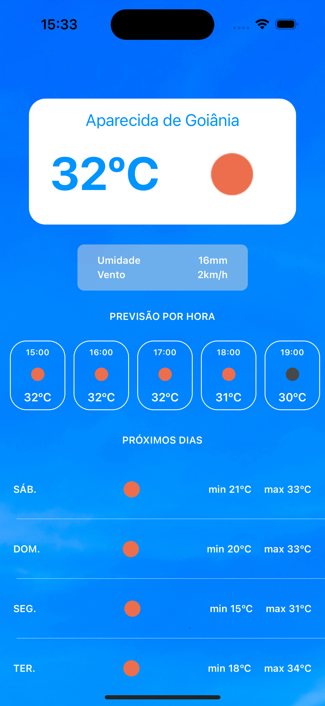
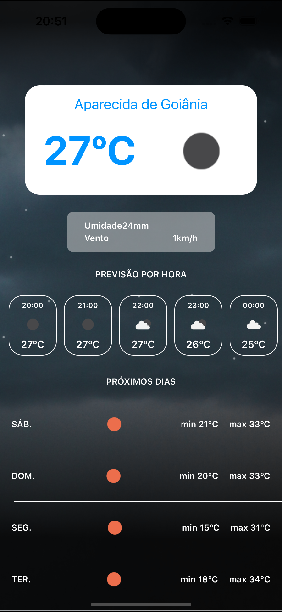

# Kronika - Weather  Forecast App

This project is a native mobile application designed in Swift with UIKit. **Kronika** helps users plan their day and stay prepared for any weather conditions.

## Table of Contents

- [Screenshots](#screenshots)
- [Features](#features)
- [Installation](#installation)
- [Contributing](#contributing)
- [License](#license)
- [Acknowledgements](#acknowledgements)

## Screenshots

| Splashscreen | Day View | Night View |
|----------|----------|----------|
|  |   |  |

## Features

- Real-time weather updates
- Current Temperature
- Humidity
- Wind Speed
- Hourly Forecasts
- Daily Forecasts

## Installation

To install the project, follow these steps:

```
git clone https://github.com/AndreDrummer/weather-forecast-1.git
cd weather-forecast-1
open weather-forecast-1.xcodeproj/
```

Now, go to [Open Weather Site](https://openweathermap.org/api/one-call-3#how), create an account and get your own API key to use.

Your must insert your API Key in the file ```weather-forecast-1/Connector/API.swift```:

<pre><code>/// Uncomment the following line and provide a valid OpenWeather API key.
// private let apiKey: String = "YOUR-API-KEY"
</code></pre>

## Contributing
To contribute, follow these steps:

1. Fork this repository.
2. Create a branch: ```git checkout -b feature-name```.
3. Make your changes and commit them: ```git commit -m 'Add some feature'```.
4. Push to the branch: ```git push origin feature-name```.
5. Submit a pull request.

## License
This project is licensed under the MIT License. See the LICENSE file for details.

## Acknowledgements
- Thanks to [Attekita Dev](https://www.youtube.com/@attekitadev) for enlightening us with her knowledge and teaching skills.
- Inspired by [weather-forecast-app](https://github.com/Bullas/weather-forecast-app).